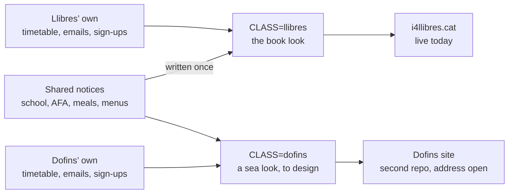

# A board for the Dofins (a big maybe)

2 October 2026

## Status: a maybe

Nothing has changed for families or in the website's code. This is an idea to pick up if helping I4A, the Dofins, goes ahead.

- The live site, i4llibres.cat, is as it was.
- Step 1 below was tried on 2 October and passed every check, then set aside in a git stash named “dofins: shared/class content split” on the owner's laptop checkout, not on Norman. Running `git stash pop` there brings it back.

## What the two classes share

Most of the board is the same for both classes. Only three kinds of notice and the look differ. Of the seven notices up on 2 October, five would be shared. I4A's class rep would send their class news.

| What | Shared or per class |
| --- | --- |
| School notices, holidays and closures | Shared |
| AFA notices and extracurriculars | Shared |
| School meals: meetings, lunchtime programme, menus | Shared |
| Infantil requests, such as the play materials | Shared |
| Timetable | Per class: a bit different, some sports together |
| Teacher's emails | Per class |
| Sign-ups: family activities, interviews | Per class |
| The look | Per class: the book for the Llibres, the sea for the Dofins |

## How: one repository, built twice

One codebase builds both boards, so a shared notice or a month's menus is written once and reaches both classes on the same push. A fork would mean doing every school notice, every `/replace-menus` and every fix twice, and the copies would drift apart.

- **Content in three places.** `src/content/shared/` holds what both classes see; `src/content/llibres/` and `src/content/dofins/` hold each class's own. The menus stay in `src/content/menus/`. A notice's file name can be in only one folder, and the build refuses it in both.
- **One setting picks the class.** `CLASS=dofins npm run build` builds the I4A board; without it, the Llibres board. The class name and group (Els Llibres, I4B or Els Dofins, I4A) fill in the titles, cover, filters and calendar files.
- **Each class has its own look.** The shared part is the plumbing: notices, translations, dates, filters, calendar exports and menu data. Each class gets its own frame around it: the book for the Llibres, a sea look for the Dofins. That look has to be more than colours, because the book's cover, pages and pocket are the layout itself.

Each build takes the shared notices plus its own class's, and wraps them in that class's look.

## Hosting and domain

The Dofins board would live in a second repository that only hosts it, because GitHub Pages serves one site per repository. The main repo's workflow builds both boards and pushes the Dofins build there, using an access token stored in the main repo. One push to `main` updates both sites.

The domain is still open. The owner won't be buying one (to confirm), so these are the options:

| Option | Address | Cost | Catch |
| --- | --- | --- | --- |
| GitHub's own address | Like neosepulveda.github.io/i4dofins/ | Free | Long to share |
| A subdomain of the owner's | Like dofins.i4llibres.cat | Free | Carries the Llibres name |
| I4A's reps buy one | Like i4dofins.cat | Theirs | They point it at the hosting repo in their domain settings |

## Steps

Step 1 is already tried and waiting in the stash. The rest would follow in order.

1. **Split the content and add the class setting, with nothing visible changing.** Tried on 2 October: the built Llibres site came out identical to before, apart from the calendar files' build timestamp. All 47 Node tests and 60 browser tests passed, including four new ones for the two classes.
2. **Add I4A's notices** from their class rep, and preview the Dofins board at an address nobody has yet, still in the book's look.
3. **Design the sea look,** following the owner's direction.
4. **Set up hosting:** the second repo, the access token, the workflow step, and the domain.
5. **Send I4A the link.**

## Open questions

- [ ] Go or no go: does the Dofins board happen at all?
- [ ] Sea look: the owner's direction for it. Nothing gets designed until it's given.
- [ ] Domain: which of the three options.
- [ ] How I4A's class rep sends their news: email, WhatsApp, or editing the site themselves.
- [ ] Credit line: “Preparat amb cura per les delegades d'I4A” assumes their reps are women. Check with their rep.
- [ ] Class pictures such as timetables share one downloads folder, so each site would carry the other's files without linking them. Sort out when I4A's timetable arrives.
